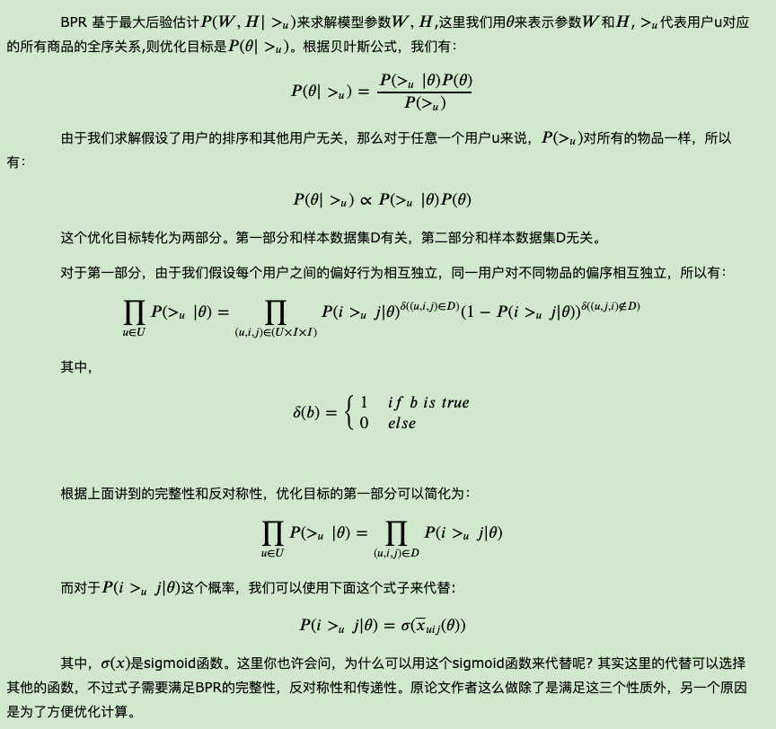
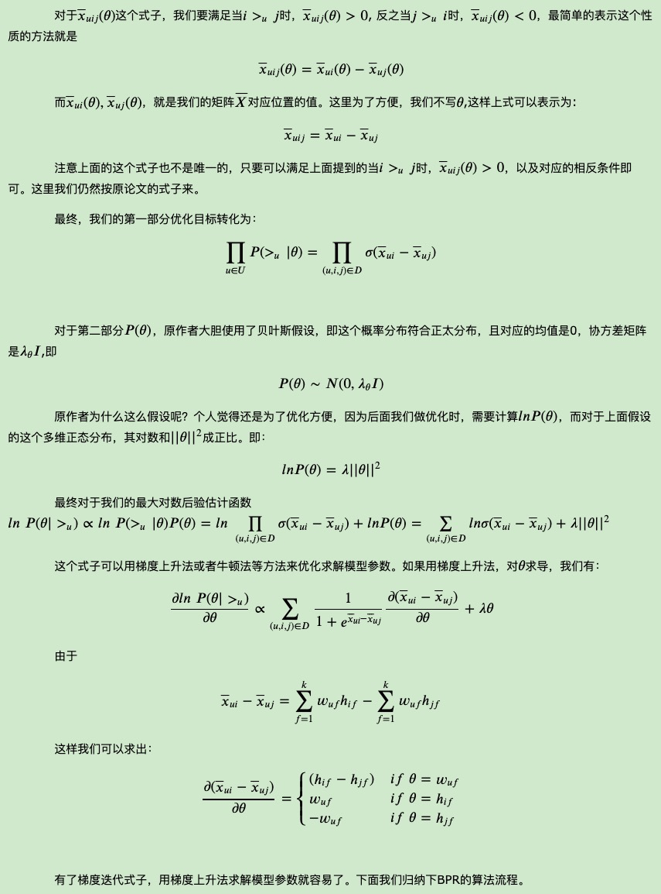
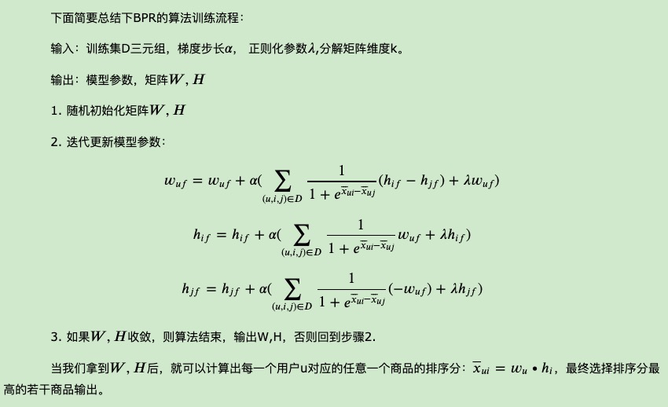

## bpr论文理解
### 1. BPR算法使用背景
&emsp;&emsp;在很多推荐场景中，都是基于现有的用户和商品之间的一些数据，得到用户对所有商品的评分，选择高分的商品推荐给用户；但是在有些推荐场景中，是为了在千万级别的商品推荐少数的商品给用户，此时更关心哪些极少数商品在用户有更高的优先级，因此需要一个排序算法，可以将每个用户对应的所有商品按喜好进行排序。

### 2. BPR排序算法背景介绍
1. pointwise:这类算法将排序问题转换为分类，回归之类的问题
2. pairwise:成对方法，在序列方法中，排序被转化为对序列分类或对序列回归，所谓的pair就是成对的排序，(a,b)表示a排在b的前面
3. listwise:采用更直接的方法对排序问题进行处理，在学习和预测过程中都将排序列表作为一个样本，排序的组结构被保持。

&emsp;&emsp;bpr算法属于pairwise方法。

### 3.bpr建模思路
&emsp;&emsp;在得到的user-item矩阵中，有些(user,item)值为0，没有隐式反馈，说明user没有买或者点击这个item行为，这说明user没有看到这个item或者user对这个item不敢兴趣或者user可能在之后的一段时间购买这个item。

#### 3.1 数据pair预处理
&emsp;&emsp;构建的数据最主要的一个指标是顺序，严格的大小顺序，那么怎么构建严格的大小顺序，在user_item矩阵中，(user,item)对可以分为两个类别，（user,item)=1，表示为显示反馈，(user,item)=0，表示为隐式反馈，那么对于一个用户user,item可以分为两个类别，分为M(评分为1的item)集合，N(评分为0的item)集合。M集合内部和N集合内部是无法获得大小关系的，但是M集合与N集合交叉的话可以获得严格的大小关系。

&emsp;&emsp;假设某用户有M个‘1’的评分，N个‘0’的评分，则该用户有M*N个pair对。

&emsp;&emsp;这样数据集由三元组<u,i,j>表示，该三元组的含义是：相对于物品j,用户u更喜欢物品i。

#### 3.2 数据假设
&emsp;&emsp;基于贝叶斯，有两个假设。
1. 每个用户之间的偏好行为相互独立，即用户u在商品i和j之间的偏好关系和其他用户无关。
2. 同一用户对不同物品的偏好顺序相互独立，即用户u在商品i和j之间的偏好和其他商品无关。

&emsp;&emsp;为了便于表述，用$>_{u}$符号表示用户u的偏好，上面的<u,i,j>可以表示为$i >_{u} j$

#### 3.3 学习参数
&emsp;&emsp;bpr也用到了类似的矩阵分解模型，这里bpr对于用户集U和物品集合I对应的U*I预测排序矩阵$X^{hat}$，期望得到两个分解后的用户矩阵W(|U| * k)和物品矩阵H(|I| * k)，满足
$$X^{hat} = WH^{T} \tag{1}$$

&emsp;&emsp;由于bpr是基于用户维度的，所以对于任意一个用户u，对应的任意一个物品i期望有:
$$x_{ui}^{hat} = w_{u}h_{i} = \sum_{f=1}^{k}{w_{uf}h_{if}} \tag{2}$$

&emsp;&emsp;最终的目标是寻找合适的矩阵W,H，让$X^{hat}$和X相似，目标和矩阵分解没什么区别，区别在于bpr的优化算法思路。

### 4 bpr算法优化的思路

### 5. bpr算法流程

### 6. bpr算法流程
&emsp;&emsp;bpr是基于矩阵分解的一种排序方法，但是和SVD之类的算法比，不做全局的评分优化，而是针对每一个用户自己的商品喜好分别做排序优化，因此在迭代优化的思路上完全不同，同时对于训练集的构建也是不同的，SVD只需要用户物品对应评分数据二元组做训练集合，而bpr则需要用户对商品的喜好做排序三元组做训练集。
